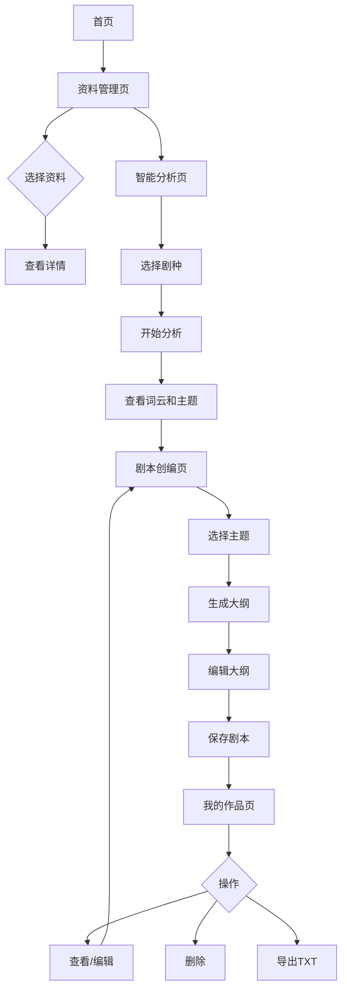

## 1. Product Overview

**剧创云 - 数字化新编智能系统赋能题材创编**是一个面向稀有剧种剧本创编的智能辅助平台。该系统整合多源资料（访谈稿、地方志、旧剧本），通过智能分析提取高频词和主题，辅助创作者快速生成剧本大纲，实现从"资料→分析→创编"的完整业务闭环。

- **目标用户**: 戏曲编剧、文化研究者、赛事评委
- **核心价值**: 智能整合多源资料，辅助稀有剧种新剧本创编
- **演示定位**: 以前端展示为核心的演示原型系统

## 2. Core Features

### 2.1 User Roles (if applicable)
无角色区分，所有用户拥有相同权限。

### 2.2 Feature Module
1. **首页/仪表盘**: 项目概览、数据统计、欢迎界面
2. **资料管理页**: 资料列表、筛选、搜索、新增、详情、删除
3. **智能分析页**: 高频词云图、主题列表、主题分布柱状图
4. **剧本创编页**: 剧种选择、主题选择、大纲生成、手动编辑、保存
5. **我的作品页**: 已保存剧本列表、查看/编辑、删除、导出

### 2.3 Page Details

| Page Name | Module Name | Feature description |
|-----------|-------------|---------------------|
| 首页/仪表盘 | 数据概览 | 展示总资料数、剧种数量、已分析主题数 |
| 首页/仪表盘 | 欢迎界面 | 项目名称展示、简洁美观的欢迎文案 |
| 资料管理页 | 资料列表 | 表格形式展示剧种、类型、标题、关键词等 |
| 资料管理页 | 筛选功能 | 按剧种下拉筛选、按资料类型下拉筛选 |
| 资料管理页 | 搜索功能 | 按标题关键词搜索 |
| 资料管理页 | 新增资料 | 弹窗表单填写，本地维护数据 |
| 资料管理页 | 查看详情 | 弹窗显示完整内容 |
| 资料管理页 | 删除资料 | 从列表中移除 |
| 智能分析页 | 剧种选择 | 下拉框选择剧种 |
| 智能分析页 | 开始分析 | 模拟分析过程，显示加载状态 |
| 智能分析页 | 高频词云图 | ECharts词云图展示高频词 |
| 智能分析页 | 主题列表 | 卡片形式展示主题名称、关键词、覆盖资料数 |
| 智能分析页 | 主题分布柱状图 | 各主题权重对比 |
| 剧本创编页 | 剧种选择 | 下拉框选择剧种 |
| 剧本创编页 | 主题选择 | 多选主题 |
| 剧本创编页 | 生成大纲 | 点击按钮生成剧本大纲 |
| 剧本创编页 | 大纲展示 | 建议剧名、分幕结构、角色设定、核心冲突 |
| 剧本创编页 | 手动编辑 | 文本框可修改 |
| 剧本创编页 | 保存剧本 | 保存到"我的作品"列表 |
| 我的作品页 | 作品列表 | 表格展示标题、剧种、主题、创建时间 |
| 我的作品页 | 查看/编辑 | 跳转回创编页继续编辑 |
| 我的作品页 | 删除作品 | 从列表移除 |
| 我的作品页 | 导出作品 | 导出为TXT文件下载 |

## 3. Core Process

用户核心流程：浏览资料 → 选择剧种进行智能分析 → 查看分析结果 → 选择主题生成剧本大纲 → 编辑完善 → 保存作品 → 管理作品

## 4. User Interface Design

### 4.1 Design Style
- **主色调**: 中国传统色系 - 朱红(#C41E3A)、墨黑(#1A1A1A)、米白(#F5F5DC)、青灰(#6B7B8A)
- **辅助色**: 金色(#D4AF37)用于强调和高亮
- **按钮风格**: 圆角矩形，朱红主按钮，米白边框按钮
- **字体**: 使用思源宋体展示标题，思源黑体展示正文
- **布局风格**: 卡片式布局，左侧导航菜单，右侧内容区
- **图标风格**: 使用Element Plus自带图标，简洁明了

### 4.2 Page Design Overview

| Page Name | Module Name | UI Elements |
|-----------|-------------|-------------|
| 首页/仪表盘 | 数据概览 | 三张统计卡片，卡片内显示数字和图标，hover有轻微上浮效果 |
| 首页/仪表盘 | 欢迎界面 | 大标题、副标题、装饰性传统纹样背景 |
| 资料管理页 | 资料列表 | 表格形式，支持排序，每行有操作按钮 |
| 资料管理页 | 筛选搜索 | 顶部工具栏，包含下拉框和搜索框 |
| 资料管理页 | 新增弹窗 | 表单弹窗，包含所有字段输入框 |
| 智能分析页 | 分析区域 | 顶部筛选区，中部词云图，底部主题卡片网格 |
| 剧本创编页 | 生成区域 | 步骤式布局，选择区在上，结果展示区在下 |
| 我的作品页 | 作品列表 | 表格形式，每行有操作按钮组 |

### 4.3 Responsiveness
- **桌面优先**: 默认适配1920x1080分辨率
- **响应式设计**: 使用Element Plus响应式布局，支持中等屏幕自适应

### 4.4 3D Scene Guidance (if applicable)
无3D场景需求。
