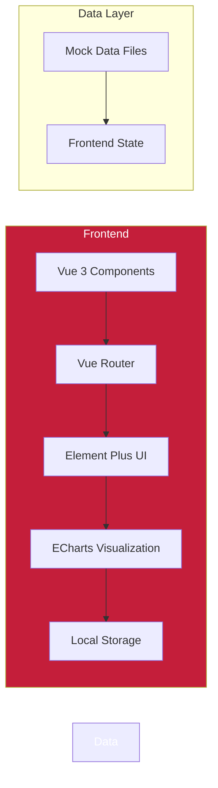
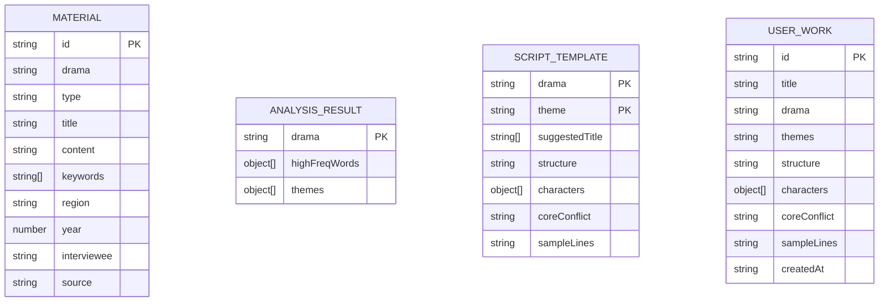

## 1. Architecture Design



## 2. Technology Description
- **Frontend Framework**: Vue 3 + TypeScript
- **UI Library**: Element Plus
- **Chart Library**: ECharts
- **Routing**: Vue Router
- **Build Tool**: Vite
- **Styling**: Tailwind CSS 3 + Element Plus Theme
- **State Management**: Vue Composition API + localStorage
- **Backend**: None (纯前端模拟，使用内置JSON数据)
- **Database**: None (前端localStorage存储用户保存的作品)

## 3. Route Definitions

| Route | Path | Component | Purpose |
|-------|------|-----------|---------|
| Home | / | Home.vue | 首页仪表盘，数据概览 |
| Materials | /materials | Materials.vue | 资料管理页 |
| Analysis | /analysis | Analysis.vue | 智能分析页 |
| Creation | /creation | Creation.vue | 剧本创编页 |
| Works | /works | Works.vue | 我的作品页 |

## 4. API Definitions (if backend exists)

本项目为纯前端演示原型，无后端API。所有数据交互通过前端内置的Mock数据完成。

## 5. Server Architecture Diagram (if backend exists)

无后端服务。

## 6. Data Model

### 6.1 Data Model Definition



### 6.2 Data Definition Language

本项目不使用数据库，所有数据以JSON格式存储在前端文件中：

**资料数据结构 (materials.json)**:
```json
{
  "id": "string",
  "drama": "string",
  "type": "访谈稿|地方志|旧剧本",
  "title": "string",
  "content": "string",
  "keywords": ["string"],
  "region": "string",
  "year": "number",
  "interviewee": "string (仅访谈稿)",
  "source": "string (仅地方志)"
}
```

**分析结果数据结构 (analysisResult.json)**:
```json
{
  "drama": "string",
  "highFreqWords": [
    {"name": "string", "weight": "number"}
  ],
  "themes": [
    {"themeName": "string", "keywords": ["string"], "materialCount": "number"}
  ]
}
```

**剧本模板数据结构 (scriptTemplates.json)**:
```json
{
  "drama": "string",
  "theme": "string",
  "suggestedTitle": ["string"],
  "structure": "string",
  "characters": [
    {"name": "string", "role": "string", "description": "string"}
  ],
  "coreConflict": "string",
  "sampleLines": "string"
}
```

**用户作品数据结构 (存储在localStorage)**:
```json
{
  "id": "string",
  "title": "string",
  "drama": "string",
  "themes": "string",
  "structure": "string",
  "characters": [{"name": "string", "role": "string", "description": "string"}],
  "coreConflict": "string",
  "sampleLines": "string",
  "createdAt": "string"
}
```

## 7. Project Structure

```
src/
├── components/           # 公共组件
│   ├── Sidebar.vue       # 左侧导航栏
│   └── Loading.vue       # 加载动画组件
├── data/                 # 模拟数据
│   ├── materials.ts      # 资料数据
│   ├── analysisResult.ts # 分析结果数据
│   └── scriptTemplates.ts # 剧本模板数据
├── pages/                # 页面组件
│   ├── Home.vue          # 首页/仪表盘
│   ├── Materials.vue     # 资料管理页
│   ├── Analysis.vue      # 智能分析页
│   ├── Creation.vue      # 剧本创编页
│   └── Works.vue         # 我的作品页
├── router/               # 路由配置
│   └── index.ts          # 路由定义
├── utils/                # 工具函数
│   └── storage.ts        # localStorage操作封装
├── App.vue               # 根组件
├── main.ts               # 入口文件
└── style.css             # 全局样式
```
